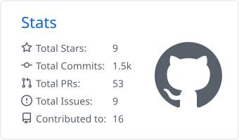
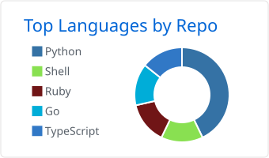
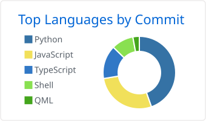

  

## My Stats

  <picture>
    <source media="(prefers-color-scheme: dark)" srcset="./assets/profile-summary-card-output/github_dark/3-stats.svg"/>
    
  </picture>
  <picture>
    <source media="(prefers-color-scheme: dark)" srcset="./assets/profile-summary-card-output/github_dark/1-repos-per-language.svg"/>
    
  </picture>
  <picture>
    <source media="(prefers-color-scheme: dark)" srcset="./assets/profile-summary-card-output/github_dark/2-most-commit-language.svg"/>
    
  </picture>

  

  <picture>
    <source media="(prefers-color-scheme: dark)" srcset="https://github-readme-activity-graph.vercel.app/graph?username=Patruxs&bg_color=0d1117&color=58a6ff&line=8b949e&point=f7786b&area=true&hide_border=false"/>
    <source media="(prefers-color-scheme: light)" srcset="https://github-readme-activity-graph.vercel.app/graph?username=Patruxs&bg_color=ffffff&color=0969da&line=57606a&point=cf222e&area=true&hide_border=false"/>
    
  </picture>

